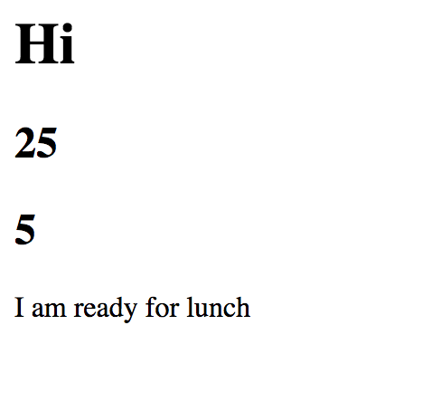

# Javascript Functions

This project is an exploration of javascript functions. We built an animal nuggetizer, and also printed some numbers to the DOM. 

## Screenshots


## How to run this project
* Use npm to install http-server in your terminal:
```sh
npm install -g http-server
```
* Run the server in your terminal
```sh
hs -p 9999
```
* Open chrome and navigate to:
```
localhost: 9999
```